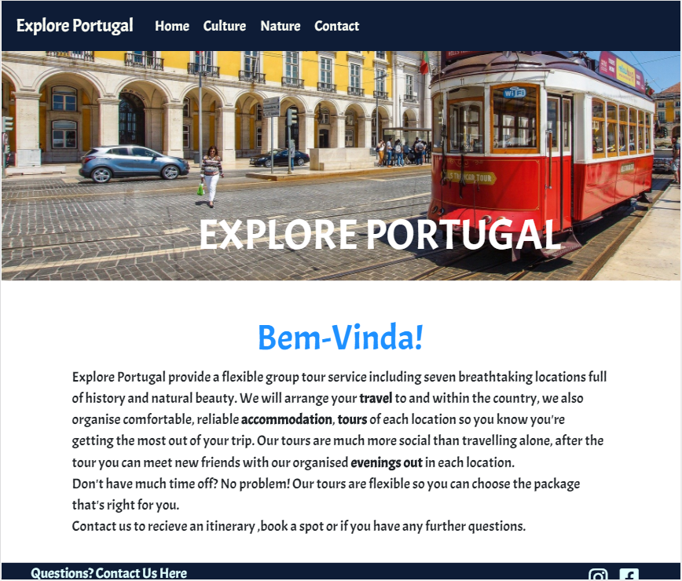
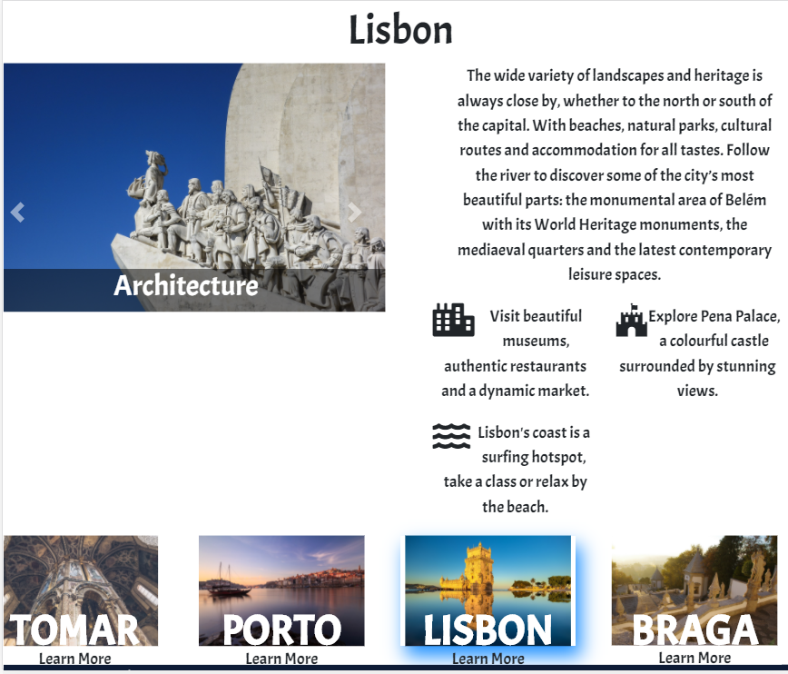
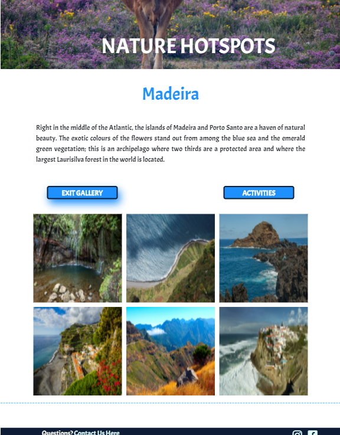
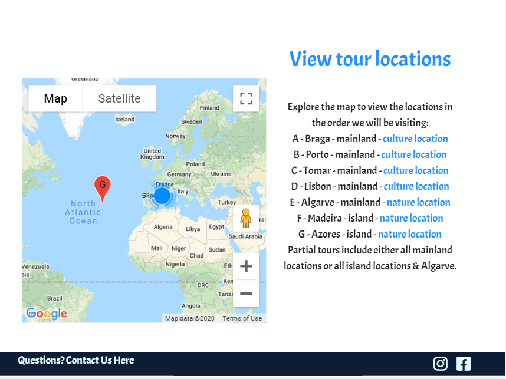
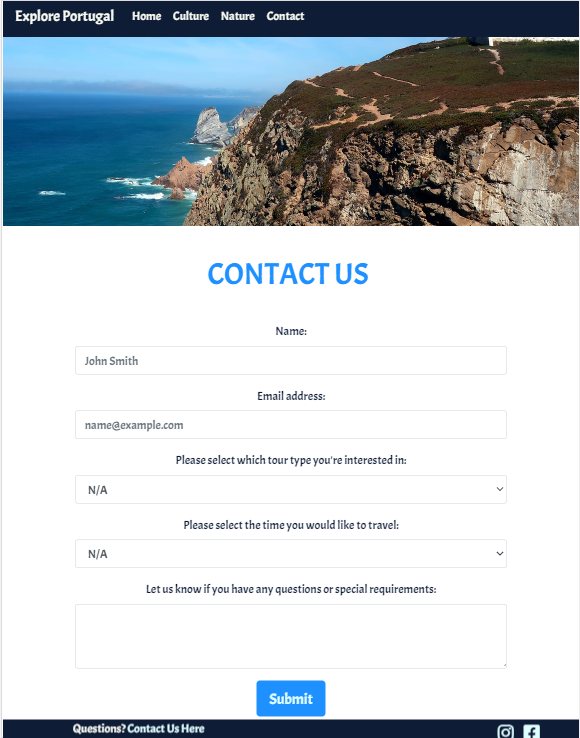

# **Explore Portugal**
---
Explore Portugal is a site for a travel company which organises tours of portugal throughout the year. 
The website is designed to attract new people to join a tour and inform them about the locations they could
visit by joining one of Explore Portugal's tours. The website also gives visitors a feel for each location 
through galleries and activity lists.   

This project consists of four pages. The index page introduces the company with a brief explanation of what the 
company does, an invitation to explore the locations through button links to culture and nature pages and allows 
them to view ,on google maps, the route of the tour through the stopping locations. Next is the Culture page, 
which outlines four culture hotspots and allows users to interact by choosing the location they wish to know more
about, when they do they are provided with a gallery, a brief description and a list of activities. 
The Nature page, similarly, contains 3 locations, each with a gallery and activity list. Finally the contact page
allows users to either ask a question or request a price based on their requirements. 
## **User stories and UX**
### **Overall design:**
1. After exploring several tourism websites I decided to make the style of the site minimal, with attention being 
focused on a few  location images as the site is for travel and visitors will be motivated to envision the trip in 
this way without being overwhelmed. 
2. The color palette was created with [coolors](https://coolors.co/), I chose this palette as the blue colours 
compliments the sky and sea which is a prominent feature in most images while the rest of the colours compliment 
the sunny theme. The dark colour was used on the navigation and footer and the lighter colours were used for hover
 effects and headings. [Palette used](https://coolors.co/ffede1-f9fbf2-1e90ff-d7f9ff-0e1c36).

### **User Stories**
* As a __potential customer__, I want to know what the company can provide and why it is better than travelling alone.
* As a __potential customer__, I want to see pictures of where I will be going and information so I can decide if this is the right trip.
* As a __customer who travels often__, I want to know where I am going geographically and gather information on each of the locations.
* As a __busy professional__ I would like to know if the tours are customizable and whether I could fit one into my schedule.
* As a __potential customer interested in joining a tour__, I want to be able to make contact with the company easily.
* As a __potential customer with specific needs__, I want to be able to communicate with the company to ensure these can be met.

### **Wireframes**
Click to view wireframes for each page:
* [Home page](assets/images/wireframes/home-wireframe.PNG)
* [Culture Page](assets/images/wireframes/culture-1-wireframe.PNG)
   
   [Culture page](assets/images/wireframes/culture-2-wireframe.PNG)
* [Nature Page](assets/images/wireframes/nature-wireframe.PNG)
* [Contact](assets/images/wireframes/contact-wireframe.PNG)
## Features
---
### Site-wide features
* __Navigation__ bar is with a fixed top so navigation is easy, the colour is dark to contrast with the header images on each page and it is collapsable, with a hamburger menu appearing on smaller screen widths.
* __Footer__, fixed to the bottom of the page with a link to the contact page so visitors are able to get to the contact section quickly and easily from any page, the social media links open in a seperate tab.
* __Custom 404__ page is displayed if there is a problem with finding a page, the page contains a link back to the homepage and a navigation bar to reach the rest of the pages.
### Index page
* __Large vibrant header image__ of a tram and bright buildings, this is intended to produce a positive reaction from visitors and fits with the fact that the site is for a travel company. As this is the first thing a visitor will see, the image is different for smaller screen widths in order to produce the same positive effect. 
* __Introduction text__ contains information on what services the company provides.
* __Holiday type buttons__ introduce visitors to the focus of the tours in each of the locations. On hovering over the images, a blue shadow appears and the text darkens, ensuring visitors know the images are clickable. Below the images is a brief description and invitation to view the locations.
* __Map and Map text__, this section uses the google maps API to display a map  of the tour stops offered by the company. Visitors will be able to see exactly which locations are included, in what order and how much of the country the trip will cover. The packages are also outlined in the map text. The section in which a specific location can be found is also avaliable through a text link. 
### Culture Page
* __Strong header image__ of a castle, gives visitors an idea of what culture locations to expect.
* __Introduction text__ gives information about Portugal’s long history and describes the influences in portugese culture.
* __Culture location buttons__ are images of the four locations which when selected open a gallery and a text introduction to the location. The gallery images are presented in a carousel, with captions across the bottom with a translucent black background. Also in this section are a list of 3 activities which will be featured in the tour and a relevant icon to break up the text and keep visitors interested. The buttons remain below the resulting location information section and the selected button has a blue shadow so visitors don’t get confused when selecting a new location. The site also only displays one location at a time so the page isn’t overwhelmed by moving images.
* __Link to nature page and map__, allows visitors to either go back to the index page and view the locations on the map or continue to the nature page and see more locations. 
### Nature Page
* __Strong header__ image of typical portugese countryside and a cow. The bright colours create a positive response and the animal creates an image of quiet rural locations.
* __Location sections__ for each tour area. Gives an inviting description of each area. Below are two buttons, for activities and the gallery. The gallery is styled with a css grid and javascript is used to create a lightbox effect when one of the images is selected, so it appears large on a dark background. The second mouse click closes the effect so another image can be selected.The activities are styled in the same way as those on the culture page, with icons to note the type of activity. The buttons for each location allow the user to view more than one nature location at a time. Seeing as both travel packages include the Algarve, those customers only interested in a mainland package will be able to see the other island locations and be enticed to upgrade. 
* __Link to home and nature pages__ to help visitors navigate to the other pages from the bottom of the page.
### Contact  Page
* __Contact form__ asks for contact details, the tour package and month the visitor is interested in and contains a textbox for questions. When the form is completed,  jsemail is used to send a confirmation email with the details of the enquiry to the user which also tells them when to expect a response. An alert also appears at the top of the screen to confirm the form has been successfully completed.

## Features left to implement
1. Add a button at the bottom of each page to scroll to the top.
2. Make location names in the map text link to the right section in the culture page without visitor having to select the name.
3. Add a next and previous button to nature galleries.

## Technologies Used

* __HTML__ was used to build all the pages for the site.
* __CSS__ was used to style the html.
* Wire frames were made with [Wireframes.cc](https://wireframe.cc/) and [Mockplus](https://www.mockplus.com/).
* __Javascript__ was used to add responsive features and APIs to the site
* [Google maps API](https://developers.google.com/maps/documentation/javascript/overview) was used to produce the map on the homepage
* [Emailjs](https://www.emailjs.com/) was used for the confirmation email feature on the contact page
* [Bootstrap](https://getbootstrap.com/) was used to add responsive grid structure to the site.
* [Jquery](https://jquery.com/), javascript and js popper was used from bootstrap to make some components functional.
* [Fontawesome](https://fontawesome.com/) was used to add icons throughout the site.
* [Google fonts](https://fonts.google.com/) was used for the main font style used throughout the site.
* [Free formatter](https://www.freeformatter.com/) was used for formatting.
* [W3C Validator](https://validator.w3.org/) was used to check HTML for errors.
* [Jigsaw validator](https://jigsaw.w3.org/css-validator/) was used to check CSS for errors.
* [Jquery](https://jquery.com/) was used to simplify javascript.

## **Testing**
---
All code was passed through validators, Jigsaw for CSS and W3C for html. All passed with no errors. After running the javascript code through a validator, some errors were detected but the code was functioning as expected. I was advised by a tutor that this is likely a false positive seeing as everything was functional.

### **Testing if user story needs are met**
* __As a potential customer, I want to know what the company can provide and why it is better than travelling alone.__
    * The home page of Explore Portugal provides details of what the company will provide( accommodation, transportation and tours). The service benefits are clear: complete package of a planned and prepared tour of the country, which would take a long time to put together alone. Another benefit gained from the service is the social aspect, travelling with a group of people rather than alone will be safer and maybe more dynamic and enjoyable.

* __As a potential customer, I want to see pictures of where I will be going and information so I can decide if this is the right trip.__
    * All pages contain a header image with views of Portugal, this gives people some idea of what they can see before exploring the site further. The culture & nature pages contain galleries for each location, giving people a feel for each area, as well as a brief description and activities available.

* __As a customer who travels often, I want to know where I am going geographically and gather information on each of the locations.__
    * The home page contains a map showing the geographic locations of all tour stops so they can see how much of the country will be travelled. The nature and culture pages contain information on all locations. Links to these pages are provided on the homepage through buttons and in the text next to the map. 

* __As a busy professional I would like to know if the tours are customizable and whether I could fit one into my schedule.__
    * The homepage explains the flexibility of the tours. Allowing the customer to fit a tour into their schedule. The contact page enquires whether customers are interested in a full or partial tour. The map on the homepage (above) shows locations included in the the full tour, and accompanying text clarifies which locations are included in the “mainland” or “island” packages.

* __As a potential customer interested in joining a tour, I want to be able to make contact with the company easily.__
    * The contact page allows customers to enquire about a specific tour type and time and any other questions. Customers who decide to contact the company are sent an email with their enquiry details and expected wait time for a reply. The fixed navigation and footer contains a link to the contact page so it’s easily accessible from each page.

* __As a potential customer with specific needs, I want to be able to communicate with the company to ensure these can be met.__
    * The contact page (pictured above) allows potential customers to ask questions about any specific needs they may have, the tour type and time are automatically marked as “N/A” so this doesn’t need to be changed if a customer simply wants to ask a question. Again an email is sent to the customer with details of their enquiry and expected reply time.

## __Testing Functionality & Responsive design__
---
### __Site wide__

* __Navigation links:__
    * To check these I clicked on all the navigation links from each page on the site, to ensure they worked and directed to the right page. I pressed the brand name link and it directed to the home page. When my mouse hovered over the links, the colour changed. 
    * Used google developer tools to view the page on different screen widths, the links are compressed and a toggle navigation button appears on screen widths below a tablet and the drop down menu is functional.
* __Footer links:__
    * To check these I pressed the Contact link which led to the contact page. Then I pressed each of the social media icons and both directed to the correct site which opened in a separate tab. Link hover effect was functional with the links changing color.
* __Custom 404 Page__
    * To check this is functional, I typed a file name which doesn't exist after the url on the browser, which bought me to the custome 404 page as expected.

### Index Page

* __Holiday type location buttons:__
    * When I hover over the buttons, the hover effect appears (blue shadow). When the button is pressed it leads to the named page successfully.
    * Used google developer tools to test whether buttons appeared stacked on screen widths smaller than a tablet.
* __Googlemaps map:__
    * When the page loaded, the map was successfully rendered with the locations appearing in clusters. Map size adjusts size for laptop, tablet and mobile.
* __Links in the map text:__
    * When I hover over the buttons, the text changes colour as planned. Pressed on every link which led to the correct page.
    * Used google developer tools to ensure map text appears below the map on screen sizes smaller than a tablet for readability.
### __Culture Page__
* __Location selector buttons:__
    * Hovered over buttons to test hover effect, a blue shadow appeared so people will know buttons can be pressed. Pressed each of the buttons, all information appeared/changed as expected and the hover effect blue shadow stayed on the selected button so it’s clear it has been selected.
    * When viewed on smaller screen width the buttons appeared stacked, in two rows of two. 
    * Gallery functioned properly with the image slideshow starting when the gallery was opened.
* __Links at bottom of page:__
    * Hovered over the links, the colour of the text changed. Pressed each of the links which led to the expected page.
### Nature Page
* __Nature location gallery and activities buttons:__
    * Hovered the mouse over each of the buttons, the bow shadow hover effect appeared. All buttons function as expected when clicked, by opening or closing gallery & activities sections. Box shadow effect stays on the exit button of the corresponding feature until the feature is closed.
* __Nature Gallery__
    * Pressed the gallery button on each location to ensure the gallery appeared. Pressed on each image to ensure lightbox effect worked, a black background with the selected image in the center appeared and was closed on the second click. 
* __Links at the bottom of the page:__
    * Hovered over the links, the text changed colour. Pressed each link to ensure it led to the right location.
### __Contact Page__
* __Form:__
    * Tried to submit the form with none of the fields filled out. The error message appeared below the form as planned.
    * Tried submitting the form with an invalid email, error message displayed next to the email input field.
    * Filled out form correctly and the success message appeared below the form. An email confirming my enquiry was also received.
## __Bugs__
### __Fixed__
1. Culture location buttons were appearing at the left of the screen instead of across the whole site (on larger screens), fixed by changing the row width to 100%.
### __Not yet fixed__
1. A white strip appears at the side of the page on some screen widths. 
2. Activities in culture page appear on the left on large screen sizes.
## __Deployment__
---
The project was created on Gitpod and pushed to Github after each major change. The master branch was used as a source for deployment on github pages. The development version is the same as the deployed version.
### __Steps taken to deploy__
1. Open Github
2. Open Explore_Portugal from the listed repositories.
3. Under the repository name, select the settings option.
4. Find the GitHub pages section
5. Select the source button and choose master branch, page automatically reloads.
6. Find the GitHub pages section again to find the link to the deployed site.

For deployed version, [click here]().
### __Steps taken to run code locally__
1. Open Github
2. Open Explore_Portugal from the listed repositories.
3. Press the green code download button above the file list and copy the url which appears in the dropdown.
4. Open Gitpod IDE.
5. In the terminal type git clone followed by the copied link and press enter  
 `git clone https://github.com/LitzN/Explore_Portugal.git`

## __Credits__
---
### __Content__
The text introduction for culture and nature locations was taken from: [wikipedia](https://en.wikipedia.org/wiki/Portugal), [visit portugal](https://www.visitportugal.com/en) and [the crazy tourist](https://www.thecrazytourist.com/).

The lightbox effect in the nature gallery was added with the help of a [youtube tutorial](https://www.youtube.com/watch?v=uKVVSwXdLr0).
### __Media__
The photos used in this site were obtained from [pixabay](https://pixabay.com/images/search/portugal/) and [Unsplash](https://unsplash.com/).
### __Acknowledgements__
I received inspiration for this project from the [visit portugal](https://www.visitportugal.com/en) website.

 
